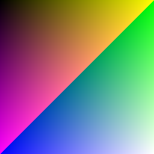

## Tag Language

A language embedded in Go struct tags. 

Go struct tags aren't *exactly* comments, but they are a comment-like extension of the core Go language that is often used in a lightly 1st class way to guide things like serialization.  

The Tag langauge takes this further, creating an expression language inside struct tags, which is then embedded in a full "programming language" defined by just declaring Go struct types.  

The following analogies generally explain how Tag works:

* Structs are functions
* Fields are variables
* Field types are statements, control flow and function calls
* Struct field tags are expressions

This program:

```go
type Color struct {
	R     int         `λ:"_0%256"`
	G     int         `λ:"_1%256"`
	B     int         `λ:"_2%256"`
	NRGBA color.NRGBA `λ:"R,G,B,255"`
}

type Image struct {
	Colors [256][256]Color `λ:"__0+__1,(__0+__1)*2,(__0+__1)*4"`
}
```

Renders this image:



Goal is to be able to write a raytracer in this "language".  The following early subset is a larger program that is working so far:

```go

type Vector struct {
	X float64
	Y float64
	Z float64
}

type VectorTimes struct {
	Vector `λ:"_0.X*_1,_0.Y*_1,_0.Z*_1"`
}

type VectorPlus struct {
	Vector Vector `λ:"_0.X+_1.X,_0.Y+_1.Y,_0.Z+_1.Z"`
}

type TracePixel struct {
	RecenterX      float64     `λ:"(128.0-_1)/512"`
	RecenterY      float64     `λ:"(_2-128.0)/512"`
	Right          VectorTimes `λ:"_0.Right,RecenterX"`
	Up             VectorTimes `λ:"_0.Up,RecenterY"`
	RightUp        VectorPlus  `λ:"Up,Right"`
	RightUpForward VectorPlus  `λ:"RightUp.Vector,_0.Forward"`
	// TODO: Create ray and trace it
}

type Raytracer struct {
	Pixels [256][256]TracePixel `λ:"_0,__0,__1"`
}

type Camera struct {
	Up      Vector `λ:"_0.X,_0.Y,_0.Z"`
	Right   Vector `λ:"_1.X,_1.Y,_1.Z"`
	Forward Vector `λ:"_2.X,_2.Y,_2.Z"`
}

type Main struct {
	Up        Vector    `λ:"0,0,1"`
	Right     Vector    `λ:"0,1,0"`
	Forward   Vector    `λ:"1,0,0"`
	Camera    Camera    `λ:"Up,Right,Forward"`
	Raytracer Raytracer `λ:"Camera"`
}
```

## TODO
* Pointer types as `if` - something like `Something *int` with `λ:"_0>0=>_0"`
* Slice types as `map` - something like `Something []int` with `λ:"Colors=>__0[0].R"` which maps a variable `Colors` into a slice of ints.
* Combination of pointers and slices to filter a map?
* Array indexing
