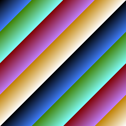

## StructTagLang

A language embedded in Go struct tags.

* Structs are functions
* Fields are variables
* Field types are statements and control flow
* Struct tags are expressions


This program:

```go
type Color struct {
	R     int         `λ:"_0%256"`
	G     int         `λ:"_1%256"`
	B     int         `λ:"_2%256"`
	NRGBA color.NRGBA `λ:"R,G,B,255"`
}

type Image struct {
	Colors [256][256]Color `λ:"__0+__1,__0,__1"`
}
```

Renders this image:

#

## TODO
* Pointer types as `if` - something like `Something *int` with `λ:"_0>0=_0"`
* Slice types as `map` - something like `Something []int` with `λ:"Colors=>__0[0].R"` which maps a variable `Colors` into a slice of ints.
* Combination of pointers and slices to filter a map?
* Sorting?
